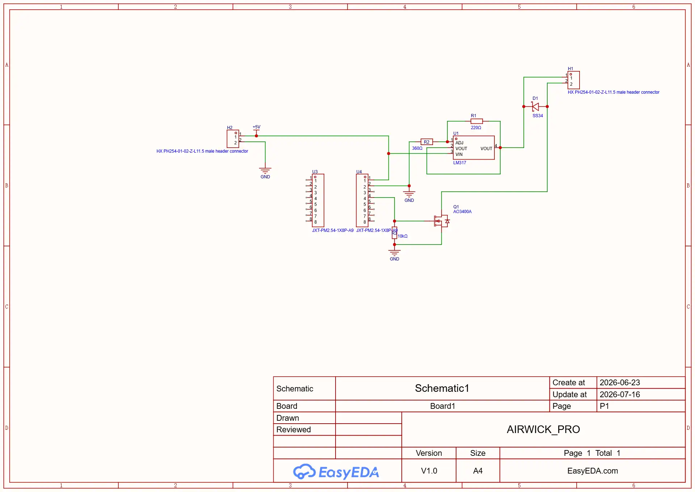
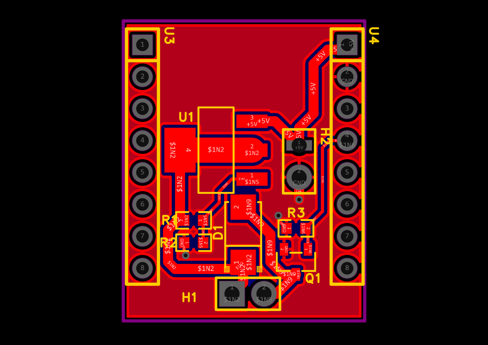
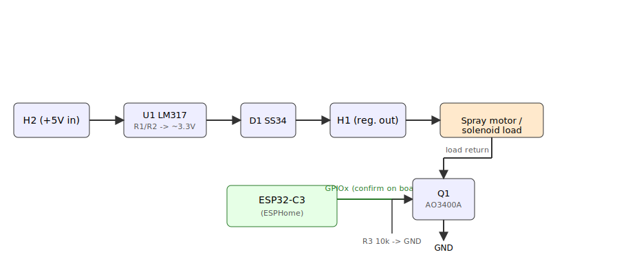

# AirWick Pro

A small custom PCB ("AIRWICK_PRO", board `Board1`, rev `V1.0`) designed in
[EasyEDA Pro](https://pro.easyeda.com/). Based on the schematic, it's a 5V-in,
regulated-output driver board with a GPIO-switched low-side MOSFET output —
the kind of add-on board used to electronically trigger an aerosol/spray
dispenser (matching the project's name) from an external microcontroller
module. The specific module isn't part of this schematic; see
[Hardware notes](#hardware-notes) below for what is and isn't certain from
the source file.

## Schematic



## PCB layout



## Bill of materials

| Designator | Part | Role |
| --- | --- | --- |
| H2 | 2-pin header, 2.54mm (`HX PH254-01-02-Z-L11.5`) | +5V power input (pin 1 = +5V, pin 2 = GND) |
| U1 | LM317 | Adjustable linear voltage regulator |
| R1 | 220 Ω | LM317 feedback resistor (VOUT → ADJ) |
| R2 | 360 Ω | LM317 feedback resistor (ADJ → GND) |
| D1 | SS34 (Schottky) | In line with the regulated output, before H1 |
| H1 | 2-pin header, 2.54mm (`HX PH254-01-02-Z-L11.5`) | Regulated output connector |
| Q1 | AO3400A (N-channel MOSFET) | Low-side switch |
| R3 | 10 kΩ | Gate pull-down for Q1 |
| U3, U4 | Two 1×8 headers, 2.54mm (`JXT-PM2.54-1X8P-A9`) | Module/expansion interface |

## Hardware notes

- **Power**: +5V and GND come in through H2. U1 (LM317) regulates this down
  to a fixed rail set by the R1/R2 divider:
  `VOUT = 1.25V × (1 + R2/R1) ≈ 1.25V × (1 + 360/220) ≈ 3.3V`.
  The regulated rail passes through Schottky diode D1 on its way to H1.
- **Switch**: Q1 (AO3400A) is a logic-level N-channel MOSFET wired as a
  low-side switch, with R3 holding its gate low (off) by default until
  driven by an external control signal.
- **U3/U4 headers**: these are two 1×8, 2.54mm-pitch headers placed opposite
  each other along the board edges (visible in the PCB layout) — a socket for
  a pluggable microcontroller module. The module used is an **ESP32-C3**
  dev board, which is the source of the MOSFET's gate-drive signal. The
  schematic/PCB source doesn't pin down *which* GPIO on the module lands on
  Q1's gate, so confirm that against the physical board (continuity check
  from the module's pin header to R3/Q1) before wiring up ESPHome — see
  below.

## Flashing ESPHome onto the ESP32-C3

The board is driven by a plug-in ESP32-C3 module (see [Hardware notes](#hardware-notes)).
[ESPHome](https://esphome.io/) turns it into a Home Assistant-native device with
no custom firmware to maintain.



### 1. Get ESPHome
- Easiest: install the **ESPHome** add-on from within Home Assistant
  (Settings → Add-ons → Add-on Store → search "ESPHome"). It gives you a
  web dashboard and compiler, no separate PC setup needed.
- Alternative: `pip install esphome`, or the browser-based
  [ESPHome Web installer](https://web.esphome.io/) (Chrome/Edge, uses Web
  Serial) for the first USB flash.

### 2. Create the device config
In the dashboard, **+ New Device** → pick an ESP32-C3 board (generic
`esp32-c3-devkitm-1` works for most breakout modules) → name it (e.g.
`airwick-pro`). Then add a switch on the MOSFET's gate pin:

```yaml
esphome:
  name: airwick-pro

esp32:
  board: esp32-c3-devkitm-1
  framework:
    type: arduino

# Added automatically by the wizard — keep both so Home Assistant can find
# and control the device once it's on Wi-Fi.
api:
ota:
  platform: esphome

switch:
  - platform: gpio
    pin: GPIO4   # confirm against the board (see Hardware notes above)
    name: "Airwick Spray"
    id: spray_switch
```

> The exact GPIO wired to Q1's gate isn't recoverable from the schematic
> source — verify it on the physical board before flashing, or the switch
> won't do anything (or worse, toggle the wrong pin).

### 3. First flash (over USB)
1. Plug the ESP32-C3 module into your PC via USB.
2. In the dashboard, **Install** → **Plug into this computer** (Web Serial),
   or from the CLI: `esphome run airwick-pro.yaml` and select the serial port.
3. Once it boots and joins Wi-Fi, all later updates go over OTA — no more
   USB required.

### 4. Connect to Home Assistant
- Same network: Home Assistant should auto-discover it (Settings → Devices
  & Services → an "ESPHome" discovery card appears) — click **Configure**
  and paste the API encryption key shown in the ESPHome dashboard for this
  device.
- Not auto-discovered: Settings → Devices & Services → **Add Integration**
  → **ESPHome** → enter the device's IP or `airwick-pro.local`.
- The `spray_switch` entity then appears as a regular HA switch — toggle it
  from the dashboard, or wire it into an automation (e.g. on a schedule or
  triggered by a sensor).

## Repository contents

```
hardware/
  images/
    schematic.webp       — full schematic render
    pcb_layout.webp      — PCB layout render (top view)
    esphome_wiring.svg   — ESP32-C3 / MOSFET wiring overview for the ESPHome guide
  source/
    ProPrj_AIRWICK_PRO_2026-07-16.epro2  — original EasyEDA Pro project archive
```

## Opening the project

The `.epro2` file in `hardware/source/` is the original EasyEDA Pro project
archive (a zip containing the schematic/PCB data plus its own image
previews). Open it in [EasyEDA Pro](https://pro.easyeda.com/) via
**File → Import → Project**. It was last saved with editor version
`3.2.149.88089769`.
